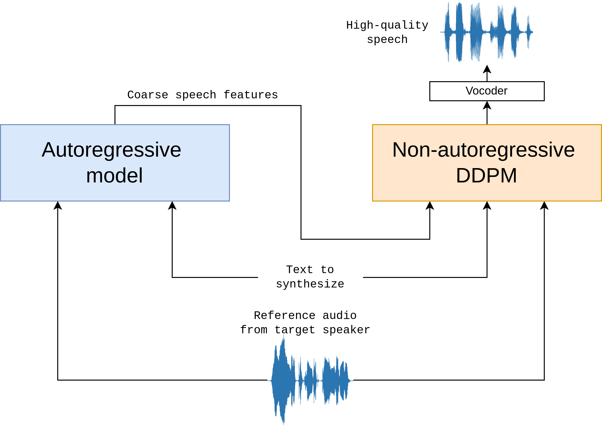

# Mars 5 TTS

This is the repo for the Mars 5 English TTS model from Camb.AI.
The model follows a two-stage AR-NAR pipeline similar to other large TTS models, but has a slightly different NAR component (see more info in the [docs](docs/architecture.md)). 
Mars 5 can generate speech from a snippet of text in the voice of any provided reference, where only 5 seconds of reference audio is needed.

Links:
- [Camb.AI website](https://camb.ai/) (use Mars5 to dub videos)
- Technical docs: [in the docs folder](docs/architecture.md)
- Colab quickstart: <a target="_blank" href="https://colab.research.google.com/github/Camb-ai/mars5-tts/blob/master/mars5_demo.ipynb"></a>
- Demo page with samples: _to come_




**Figure**: the high-level architecture flow of Mars 5. Given text and a reference audio, coarse (L0) encodec speech features are obtained through an autoregressive transformer model. Then, the text, reference, and coarse features are refined in a multinomial DDPM model to produce the remaining encodec codebook values. The output of the DDPM is then vocoded to produce the final audio.


## Quickstart


We use `torch.hub` to make loading the model easy -- no cloning of the repo needed. The steps to perform inference are simple:

1. **Install pip dependancies**: we have 3 inference dependencies only `torch`, `torchaudio`, `librosa`, `vocos`, and `encodec`. Python must be at version 3.10 or greater, and torch must be v2.0 or greater.

```bash
pip install --upgrade torch torchaudio librosa vocos encodec
```

2. **Load models**: load the Mars 5 AR and NAR model from torch hub:

```python
import torch, librosa

mars5, config_class = torch.hub.load('Camb-ai/mars5-tts', 'mars5_english', trust_repo=True)
# The `mars5` contains the AR and NAR model, as well as inference code.
# The `config_class` contains tunable inference config settings like temperature.
```
3. **Pick a reference** and optionally its transcript:

```python
# load reference audio between 1-12 seconds.
wav, sr = librosa.load('<path to arbitrary 24kHz waveform>.wav', 
                       sr=mars5.sr, mono=True)
wav = torch.from_numpy(wav)
ref_transcript = "<transcript of the reference audio>"
```

The reference transcript is an optional piece of info you need if you wish to do a deep clone.
Mars5 supports 2 kinds of inference: a shallow, fast inference whereby you do not need the transcript of the reference (we call this a _shallow clone_), and a second slower, but typically higher quality way, which we call a _deep clone_.
To use the deep clone, you need the prompt transcript. See the [model docs](docs/architecture.md) for more info on this. 

4. **Perform the synthesis**:

```python
# Pick whether you want a deep or shallow clone. Set to False if you don't know prompt transcript or want fast inference. Set to True if you know transcript and want highest quality.
deep_clone = True 
# Below you can tune other inference settings, like top_k, temperature, top_p, etc...
cfg = config_class(deep_clone=deep_clone, rep_penalty_window=100,
                      top_k=100, temperature=0.7, freq_penalty=3)

ar_codes, output_audio = mars5.tts("the quick brown rat.", wav, 
          ref_transcript,
          cfg=cfg)
# output_audio is (T,) shape float tensor corresponding to the 24kHz output audio.
```

That's it! These default settings provide pretty good results, but feel free to tune the inference settings to optimize the output for your particular example. See the [`InferenceConfig`](inference.py) code or the demo notebook for info and docs on all the different inference settings.

_Some tips for best quality:_
- Make sure reference audio is clean and between 1 second and 12 seconds.
- Use deep clone and provide an accurate transcript for the reference.
- Use proper punctuation -- the model is can be guided and made better or worse with proper use of punctuation and capitalization.


## Checkpoints

The checkpoints for Mars 5 are provided under the releases tab of this github repo. We provide two checkpoints:

- AR fp16 checkpoint, along with config embedded in the checkpoint.
- NAR fp16 checkpoint, along with config embedded in the checkpoint.
- The byte-pair encoding tokenizer used for the L0 encodec codes and the English text is embedded in each checkpoint under the `'vocab'` key, and follows roughly the same format of a saved minbpe tokenizer. 

## Contributions

We welcome any contributions to improving the model. As you may find when experimenting, it can produce really great results, but is still somewhat unstable and doesn't _consistently_ provide excellent outputs.
If you would like to contribute any improvement to Mars, please feel free to raise a pull request and one of the developers will take a look.
Areas we are looking to improve, and welcome any contributions:

- Inference stability
- Speed/performance optimizations
- Improving reference audio selection when given long references.
- Any other fun and useful ideas to expand the capabilities of Mars.

## Acknowledgements

Parts of code for this project are adapted from the following repositories -- please make sure to check them out! Thank you to the authors of:

- TransFusion: [https://github.com/RF5/transfusion-asr](https://github.com/RF5/transfusion-asr)
- Multinormial diffusion: [https://github.com/ehoogeboom/multinomial_diffusion](https://github.com/ehoogeboom/multinomial_diffusion)
- Mistral-src: [https://github.com/mistralai/mistral-src](https://github.com/mistralai/mistral-src)
- minbpe: [https://github.com/karpathy/minbpe](https://github.com/karpathy/minbpe)
- gemalo-ai's encodec Vocos: [https://github.com/gemelo-ai/vocos](https://github.com/gemelo-ai/vocos)
- librosa for their `.trim()` code: [https://librosa.org/doc/main/generated/librosa.effects.trim.html](https://librosa.org/doc/main/generated/librosa.effects.trim.html)


